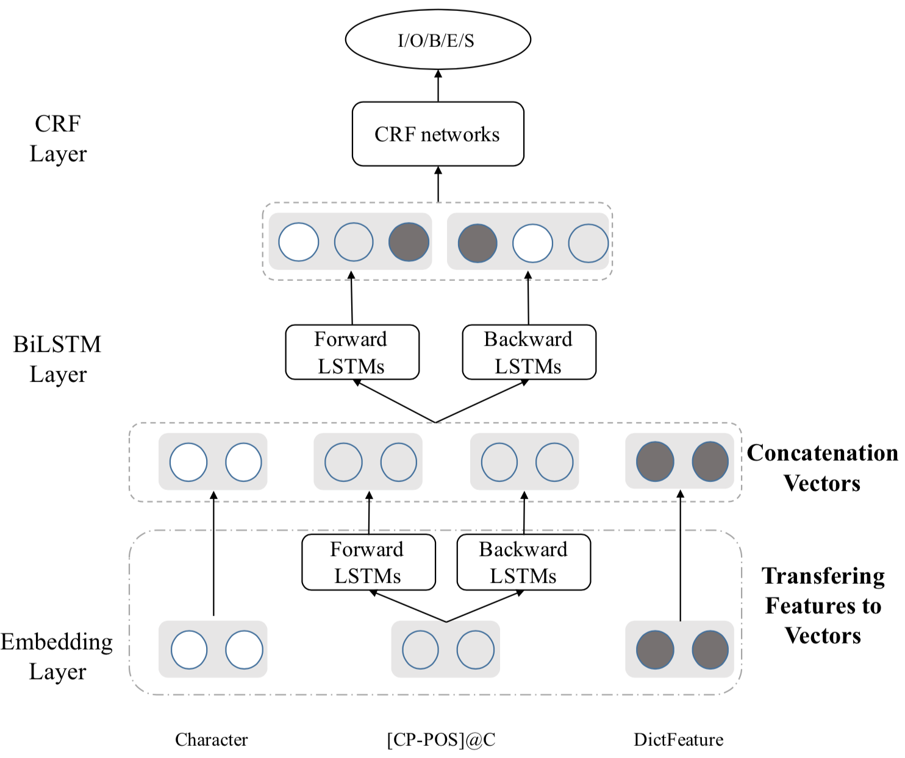

# Chinese Opinion Target Extraction
Pytorch implement of "Character-based BiLSTM-CRF Incorporating POS and Dictionaries for Chinese Opinion Target Extraction", ACML2018 [\[paper](http://proceedings.mlr.press/v95/li18d.html), [pdf\]](http://proceedings.mlr.press/v95/li18d/li18d.pdf)

### Dependency

While this implement might work for many cases, it is only tested for environment below:

```
python == 3.6.0
torch == 0.4.1
thulac == 0.2.0
tqdm
keras == 2.1.2
numpy == 1.15.3
numba
```

### Usage

1. Install dependency
2. Download dataset from [this repo](https://github.com/lsvih/chinese-customer-review), move files into `./dataset` folder, then unzip `dictionary.zip`.
3. Train model: `python3 main.py --type=train --dataset=baidu`
4. Test model: `python3 main.py --type=test --dataset=baidu`

> Note: It would cost about 10~20 minutes for pre-processing.

### Architecture

<div align=center>

</div>

### Results

|   | Baidu | Mafengwo | Dianping |
| --- | --- | --- | --- |
| P | 85.791 | 83.273 | 83.753 |
| R | 82.531 | 89.989 | 85.672 |
| F1 | 84.130 | 86.501 | 84.702 |

### Citation

If you find this work is useful in your research, please consider citing:

```
@inproceedings{li2018character,
  title={Character-based BiLSTM-CRF Incorporating POS and Dictionaries for Chinese Opinion Target Extraction},
  author={Li, Yanzeng and Liu, Tingwen and Li, Diying and Li, Quangang and Shi, Jinqiao and Wang, Yanqiu},
  booktitle={Asian Conference on Machine Learning},
  pages={518--533},
  year={2018}
}
```

